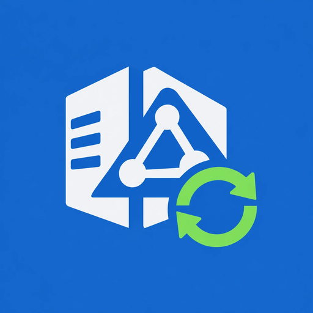

<p align="center"></p>

# ReplScope

Moniteur de réplication Active Directory moderne, inspiré de `replmon`, pour Windows Server 2022 à 2026.

- **Lecture seule** : aucune écriture dans l'annuaire, aucun identifiant stocké (Kerberos, compte courant).
- **Session locale ou poste hors domaine** : si la session Windows n'est pas un compte du domaine, ReplScope détecte le domaine de la machine et propose *Action > Se connecter en tant que…*. Le compte saisi reste en mémoire pour la session, il n'est jamais écrit ni journalisé.
- **Avancement en direct** : DC découverts immédiatement, état mis à jour au fil des réponses, barre de progression, journal horodaté, bouton Arrêter / Échap.
- **Arbre** Forêt → Site → DC → partitions, avec l'état le plus dégradé remonté sur les sites.
- **Colonnes** : source, site source, dernier succès, âge, échecs consécutifs, code d'erreur (hex), message. Tri par colonne, filtre texte.
- **Seuils d'alerte** réglables, mise à jour automatique (1 à 30 min), export CSV protégé contre l'injection de formules.
- Parallélisme borné (8 DC), délai de 30 s par DC, instance unique, DPI par moniteur.

## Utilisation

Téléchargez `ReplScope.exe` depuis les [Releases](../../releases) et lancez-le sur une machine jointe au domaine (compte de domaine standard suffisant). Exécutable autonome : aucun runtime .NET à installer.

### Mode ligne de commande (supervision, tâche planifiée)

```powershell
ReplScope.exe --export C:\Supervision\repl.csv [--forest contoso.lan]
```

Utilise uniquement le compte de la session : aucun mot de passe n'est accepté en ligne de commande. Code de retour : `0` OK, `1` alerte, `2` échec de réplication, `3` erreur de collecte, `4` arguments invalides.

## Compilation

```powershell
dotnet publish src/ReplScope.csproj -c Release -r win-x64 --self-contained true `
  -p:PublishSingleFile=true -p:IncludeNativeLibrariesForSelfExtract=true -p:EnableCompressionInSingleFile=true -o dist
```

Nécessite le SDK .NET 10.

## Limites

L'API `System.DirectoryServices.ActiveDirectory` est synchrone : la progression est par DC, pas par partition. Les latences de réplication de bout en bout ne sont pas mesurées.
